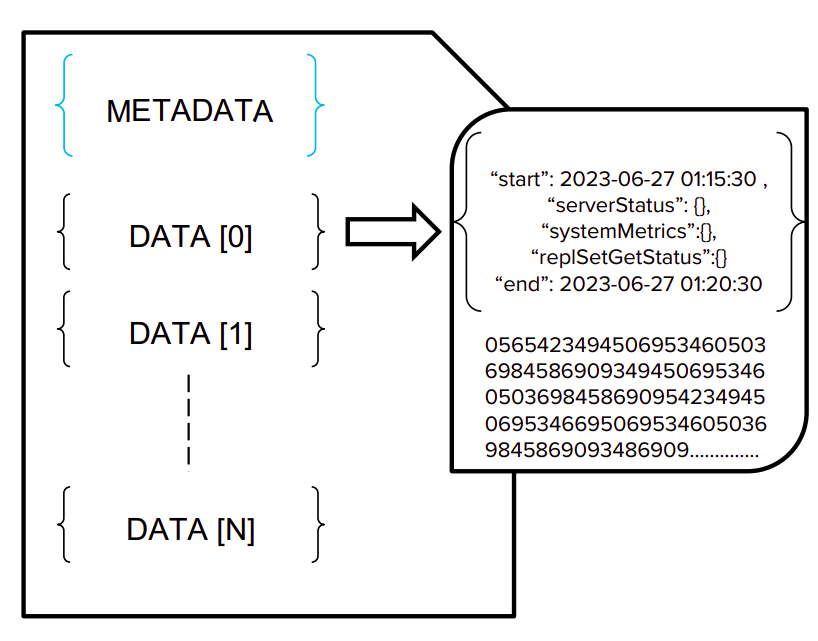
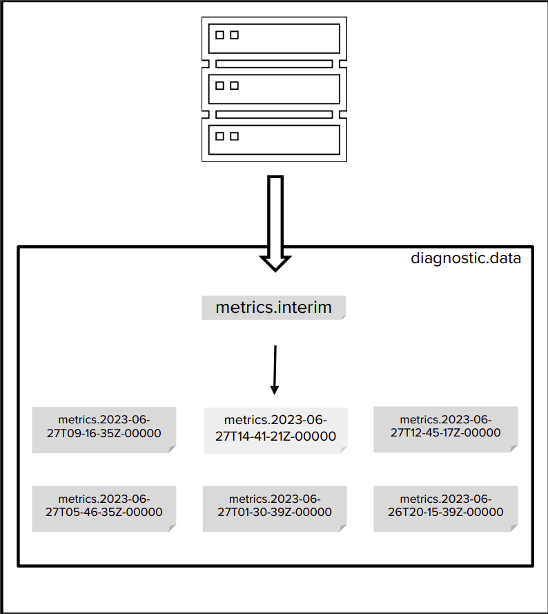

# MongoDB FTDC Analyzer

# Summer Internship Project ‘23

## Vaibhav Kashera

### Backend - Platform

# Summary

The main aim of the project is to help visualize anomalous metrics corresponding to a ticket drop using FTDC logs (Full Time Diagnostic Capture). 

## Dependencies

```python
pymongo == 3.7.2
reportlab
scikit-learn
boto3
pandas
svglib
requests
bs4
markdown
zlib
matplotlib
```

## Usage

```bash
**python3** **FTDC_decoder.py** [-h] (**--input INPUT | --input_url INPUT_URL**) [--aws_region AWS_REGION] [--s3_bucket_name S3_BUCKET_NAME] [--aws_access_key_id AWS_ACCESS_KEY_ID] [--aws_secret_access_key AWS_SECRET_ACCESS_KEY] [--openai_api_key OPENAI_API_KEY] [--output_dir OUTPUT_DIR] **--timestamp TIMESTAMP** [--interval INTERVAL] [--exact EXACT]
```

- Need either `--input` or `--input_url` parameters to run the code. The script downloads from the `--input_url` if it's a direct downloadable link like aws. We can specify a local tar/tar.gz or an extracted directory as well in the `--input` flag.
- `--timestamp` needs to be specified as time from epoch in milliseconds. All times in the script are UTC. The script locates the ticket drop from twice the interval size. eg. if the interval size is 5 minutes(default), then the script searches from 10 minutes before the given timestamp.
- `--aws_region`: AWS region
- `--s3_bucket_name`: Name of the S3 bucket.
- `--aws_access_key_id`: AWS access key ID.
- `--aws_secret_access_key`: AWS secret access key.
- `--openai_api_key`: OpenAI API key.
- `--output_dir`: Output directory to save the report and temporary extracted files
- `--interval`: Interval in minutes for bucket duration.
- `--exact`: Integer indicating whether to use the given timestamp as the drop time or not.

## Structure of an FTDC log file



- A BSON (Binary JSON) document.
- **Components**: Contains a metadata JSON object and several zlib compressed objects.
- **Zlib Objects**: Consist of a BSON object plus run length encoded delta values.
- **Value Storage**: 300 values per zlib object - 1 BSON document and 299 deltas.
- **Space Efficiency**: Utilizes run length encoding for 299 delta values, minimizing space usage.

## Log organization

- **Storage**: Mongo stores FTDC in diagnostic.data directory, capped at 200 MiB by default.
- **Log Management**: log rotation occurs on exceeding cap, deleting older files first.
- **Metrics Handling**: Metrics are monitored every second and dumped to the interim file.
- **File Management**: The interim file gets consolidated into a larger file every 5 minutes, capped at 10 MiB



## The flow of the code

### FTDC_decoder.py

- `__main__` :
    
    Tasks:
    
    - parse arguments and preprocess data
    - download and/or extract tar files into a temporary directory for processing
    - create the `FTDC` object which performs decoding of the processed files
    - upload the generated report to an S3 bucket whose credentials are extracted from either env, args or sprinklr env.
    - Generate the downloadable link to the report and clear the temporary files.
- `FTDC`
    - `def process(self)`: performs the first level of extraction and decompression to return meta and data objects. Calls the `__extract` and `__decode` functions to process the decompressed files
    - `def __extract(self):` Extracts metadata(type=0) and raw data(type=1) documents from the first level decoded items.
    - `def __decodeData(self):`  This method decodes and processes data stored in BSON format, and decompresses it with zlib compression. It iterates through each document in rawDataDocs. Each document is decompressed and parsed. If the parsed data's start time is within a specified range, the method creates a metrics document from the parsed data. The method then unpacks and reads certain metrics from the reader, and stores each metric's values in the metric_list. Also calls `create_metric` function which helps to create a metrics document.
        
        It also creates an object to the analysis class (`FTDC_analysis.py`), calls the `parseAll` function which parses the processed data to produce time-series data, which also segregates metrics based on their point-in-time or accumulate nature.
        
    - `def create_metric(self, data, prevkey=""):` Recursively creates metrics from the provided data. This method traverses the data which can be a dictionary, a list, or a scalar value (such as an integer, a boolean, or a datetime). It generates metric names based on
    the keys of the dictionary or the indices of the list. For scalar values, it directly appends them to the metric list with their corresponding metric names.

### FTDC_analysis.py

> This class is designed to handle the analysis of MongoDB's FTDC data which includes the preparation of certain metrics for visualizing and processing the data. The main responsibilities of this class include structuring the data and performing analysis to filter only relevant metrics.
The class also creates an input string to request a response from chatgpt-4
Then it renders a plot in a PDF integrated with the output of chatgpt-4
> 
- `__init__` : initiates the class parameters
- `def parseAll(self)` : This method parses all the data from the metrics object and computes certain metrics. This includes performing delta operations on certain metrics,
handling new metrics that may appear during the process, and dealing with edge cases where the number of metrics or deltas changes. Calls the `analytics` function to perform further processing including creation of a dataframe and metrics filtering
- `def analytics(self, metricObj, queryTimestamp)` : This method initializes analytics based on the metric object, prepares a dataframe from the metric object, calculates bounds, and then checks if there is an anomaly. If an anomaly is found, it calculates the anomaly, creates a gpt string base, creates an anomaly object, sends a request to OpenAI's GPT model, and finally generates a plot. It calls the `_prepare_dataframe()`, `calcBounds()`, `_calculate_anomalies()`, `_create_anomaly_obj()` , `_openAI_req()` and `__plot()` functions.
- `def __plot(self, df, to_monitor, vert_x, gpt_out="")` : This method plots the metrics data onto a PDF file. Initializes the `FTDC_plot` class and calls the `plot()` function to implement this.
- `def calcBounds(self, df, pos, delt):` Calculate the bounds of a range within a data frame based on certain conditions.

```
The function scans the DataFrame within a certain range, defined by the index of query timestamp(`pos`) and interval duration. `delt` represents half of the time interval of a bucket

It checks for conditions where read and write tickets fall below a specified limit. If both write or read ticket counts fall below the limit, it sets the starting point 't0' and type 'typ' of the drop accordingly.

If no such conditions are met it sets 't0' to 'pos'.If check is specified as 1, we override the search process and set `t0` to `pos` instead. It then fills `tbounds` with the indices of the start of each interval in the dataframe.
    
Two consecutive values in `tbounds` can be used to slice an interval equal to the duration of the bucket.
```

### FTDC_plot.py

- `__init__` : Initialize the FTDC_plot class with the dataframe to monitor, vertical line
position (vert_x), optional GPT output (gpt_out), and the output file path. Also define subheadings for the sections and a dictionary for expanding the subheadings.
- `def custom_sort(self, arr)` : A function to sort an array based on custom conditions. The sorting conditions are dependent on the string prefixes of the array elements. Helpful in arranging
- `def dumpGPT(self, canvas, y=A3[1]):` Function to convert a markdown string to a PDF file using the reportlab library. It traverses through the BeautifulSoup parsed HTML content of the markdown string and adds corresponding elements to the PDF file.
- `def plot(self):` Function to generate plots and embed them in a PDF report. It uses matplotlib for plot generation, svglib to convert SVG to ReportLab Drawing, and ReportLab to generate the PDF.The function starts by sorting the columns to be monitored. Then, for each column, it generates a plot, saves it as an SVG image, and adds it along with corresponding text to the PDF.